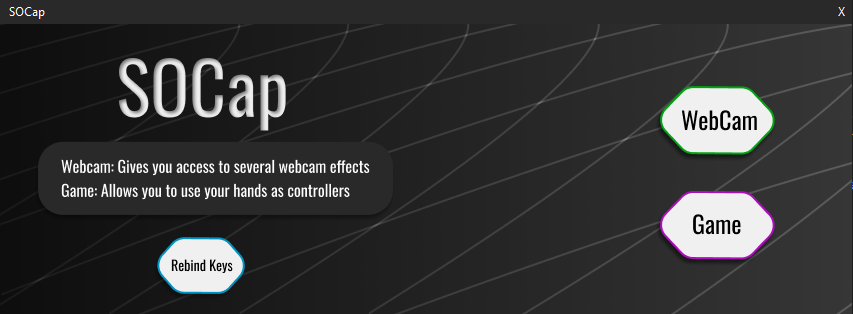
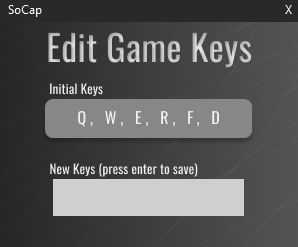

## Overview :crystal_ball:
A project using OpenCV and Mediapipe to play games :video_game: and apply webcam filters :camera:.

## Installation :electric_plug:

```bash
pip install -r requirements.txt
```

## Startup :computer:

Once you have ran the SOCap.exe file, or the main.py file, you should see a window as such:


From here, you can use the 'Webcam' button to open your device's webcam and begin applying filters, or you may use the 'Game' button to open your device's webcam and start using your hands as controllers.




Additionally, you may use the 'Rebind' button to open the above window.
Once open, you may enter keys in the order of Index finger, Middle finger, Ring finger, Pinky finger, Index + Middle finger, and Ring + Pinky finger.

## Usage :book:
    
As mentioned above, to apply filters and use your left hand as a controller, you simply tap your desired finger to your thumb in almost a pinch motion :pinching_hand:. For example, if you wish to blur the background behind you, simply tap the tip of your Index finger to the tip of your thumb.

#### Webcam Filter controls :camera:
&nbsp;&nbsp;&nbsp;&nbsp;&nbsp;&nbsp;**Blur Background**: Tap your first finger (Index finger) to your thumb as such :pinching_hand:.  
&nbsp;&nbsp;&nbsp;&nbsp;&nbsp;&nbsp;**Replace Background**: Tap your second finger (Middle finger) to your thumb.  
&nbsp;&nbsp;&nbsp;&nbsp;&nbsp;&nbsp;**Censor User**: Tap your third finger (Ring finger) to your thumb.  
&nbsp;&nbsp;&nbsp;&nbsp;&nbsp;&nbsp;**Remove Colour**: Tap your fourth finger (Pinky finger) to your thumb.  
&nbsp;&nbsp;&nbsp;&nbsp;&nbsp;&nbsp;**Freeze Frame**: Tap both your first and second fingers (Index and Middle) to your thumb.  
&nbsp;&nbsp;&nbsp;&nbsp;&nbsp;&nbsp;**Clone**: Tap both your third and fourth fingers (Ring and Pinky) to your thumb.  

#### Game controls (Default) :video_game:
&nbsp;&nbsp;&nbsp;&nbsp;&nbsp;&nbsp;**Q**: Tap your first finger (Index finger) to your thumb as such :pinching_hand:.  
&nbsp;&nbsp;&nbsp;&nbsp;&nbsp;&nbsp;**W**: Tap your second finger (Middle finger) to your thumb.  
&nbsp;&nbsp;&nbsp;&nbsp;&nbsp;&nbsp;**E**: Tap Tap your third finger (Ring finger) to your thumb.  
&nbsp;&nbsp;&nbsp;&nbsp;&nbsp;&nbsp;**R**: Tap your fourth finger (Pinky finger) to your thumb.  
&nbsp;&nbsp;&nbsp;&nbsp;&nbsp;&nbsp;**F**: Tap both your first and second fingers (Index and Middle) to your thumb.  
&nbsp;&nbsp;&nbsp;&nbsp;&nbsp;&nbsp;**D**: Tap both your third and fourth fingers (Ring and Pinky) to your thumb.  
## Contributors :busts_in_silhouette:

[Ravnit Lotay](https://github.com/Ravnit202), [Niral Patel](https://github.com/niralpatel02), [Nabeel Dar](https://github.com/NabeelDar)
